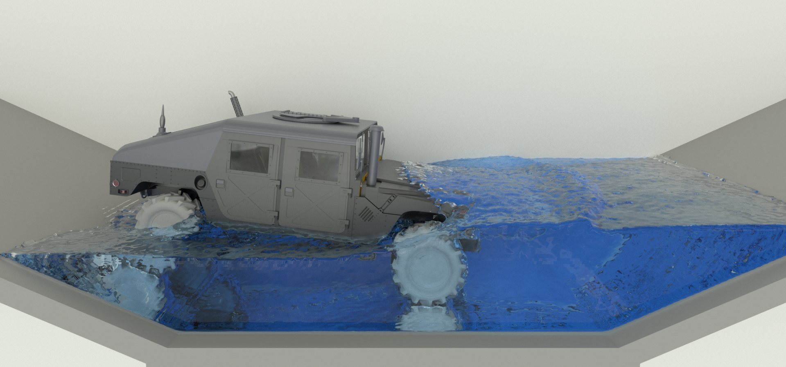
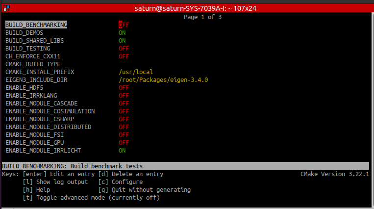
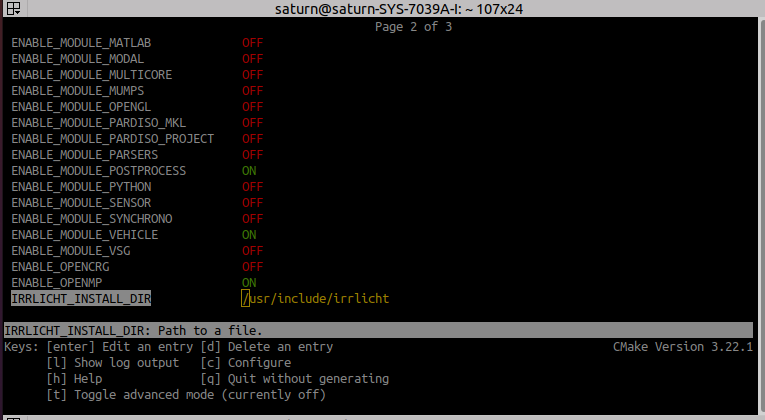
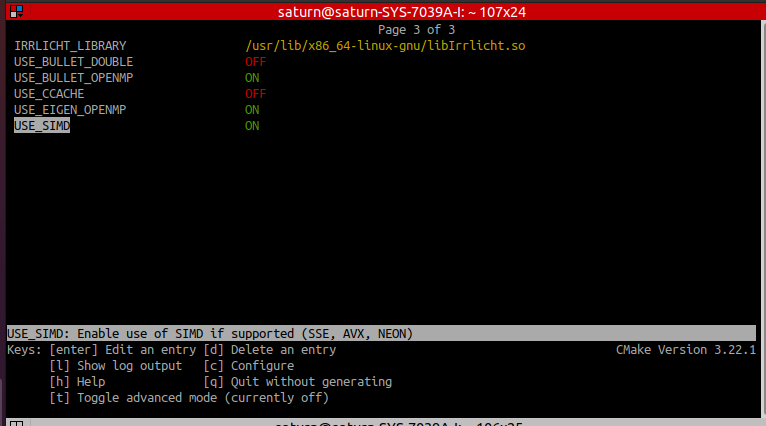
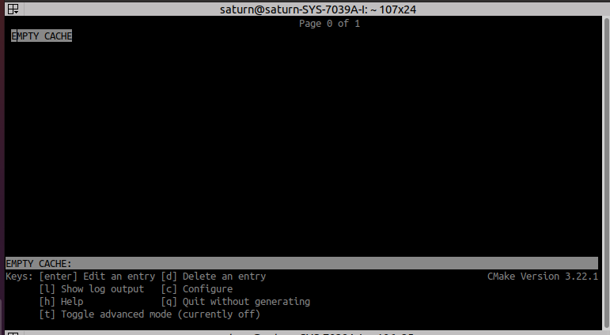
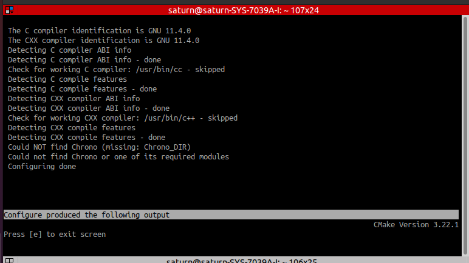
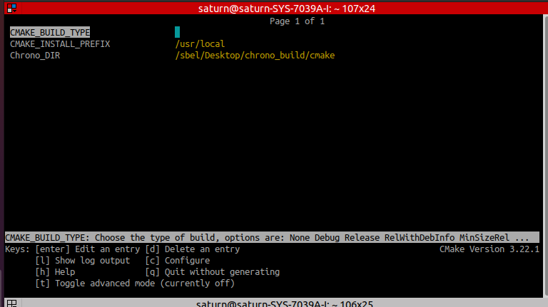
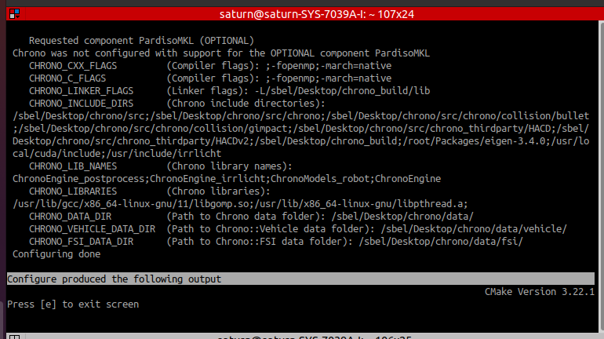

# chrono_tutorials

物理シミュレータChronoをC++で用いるためのサンプルプログラム。
ビルドシステムにはCMakeを使用する。

<div align="left">

</div>

## Installation
執筆時点（2023/11/28）でのインストール方法を示す。
今回はProject Chrono公式が提供しているDockerイメージ[uwsbel/projectchrono](https://hub.docker.com/r/uwsbel/projectchrono)を用いる。

#### Environment 
以下はローカル環境ではなく、Dockerイメージとして構築した環境条件である。
- OS: Ubuntu 22.04
- Chrono: 8.0.0
- CMake: 3.22.1

まずはじめに、ChronoのDockerイメージをダウンロードする。
**[重要] Dockerのlatest版はGitHub上のmainブランチでも8.0.0タグでもないバージョンである（結局どのバージョンに該当するのかは未確認）。デモプログラムに関しても、公式HPチュートリアルに乗っているプログラムと若干異なっているので注意。**
```bash
docker pull uwsbel/projectchrono:latest
```
続いてDockerコンテナを生成する。ちなみに今回使用しているローカル環境はNvidia GPUを使用していないため、`nvidia-docker`は不要である（逆に言えば、Nvidia GPU搭載PCを用いる場合は`nvidia-docker`をインストールしておく）。
ただし、シミュレータなどのGUI表示を行う必要があるので、いくつか特殊な設定をする必要がある。
具体的には、今回は以下のコマンドを実行した。
```bash
docker run -it \
--net=host \
--env=DISPLAY=$DISPLAY \
--env=QT_X11_NO_MITSHM=1 \
--volume="/home/$USER:/home/$USER" \
--volume="$HOME/.Xauthority:/root/.Xauthority" \
--volume="/tmp/.X11-unix:/tmp/.X11-unix:rw" \
--name chrono_env00 \
uwsbel/projectchrono:latest \
bash
```

問題なくコンテナが生成できたら、続いて必要なソフトウェアをインストールしておく。
```bash
apt update
apt upgrade
apt install gedit cmake-curses-gui git
```

続いてChronoライブラリのビルドを行う。
基本的には[公式ビルド手順](https://api.projectchrono.org/8.0.0/tutorial_install_chrono.html)に従えば問題ないが、`Eigen Library`と`Irrlicht Library`のダウンロードに関してはあらかじめDockerコンテナに含まれているのでスキップしてよい。

`chrono_build`というディレクトリを作成し、そこでビルドファイルを生成する。
```bash
cd ~/Desktop
mkdir chrono_build
cd chrono_build
ccmake ../chrono/
```

各種設定値が下図のようになっていればOK。`[c]Configure`を押した際のログが`Configure Done`になっていて、エラーも出ていなさそうであれば`[g]Generate`を入力してMakeFileを生成する。
<div align="left">



</div>

問題なく生成されていれば、`chrono_build`ディレクトリ内にMakeFileなどが生成されるはずである。
最後に以下コマンドを入力してビルドを開始する（今回使用している端末はCPUが48コア(!)もあるので、並列計算させるとすごく早く終わる）。
```bash
make -j48
```

## Build demos with CMake
独自プログラムでChronoを使用したい場合は、各種ライブラリをインクルードすればよい。
詳細な手順は[Building a project that uses Chrono](https://api.projectchrono.org/8.0.0/tutorial_install_project.html)に記載があるが、この通りに実行してもビルドエラーが発生して非常に辛かった。
以降ではその原因についても簡単に触れておく。

ここでは例として、リポジトリの`demo`ディレクトリ内にある`build_system`というデモプログラムを参考に、ビルド手順を示す。他のデモについても同様の手順でビルドすることができる。

まずはソースコードまで移動し、`build`ディレクトリを作成する。
その後、事前に用意してある`CMakeLists.txt`を使ってMakeFile生成を開始する。
```bash
cd demos/build_system
mkdir build
cd build
ccmake ../
```

このとき、以下のような画面表示になるはず。`[c]Configure`を入力する。
<div align="left">

</div>

続いて下図の画面に遷移するはず。ログ表示の通り、`Chrono_DIR`という変数が定義されていないためにChrono関連ライブラリが見つからないと言われている。`[e]Exit`を入力して一旦Configure処理を停止する。

<div>

</div>

変数一覧画面に戻ると、`Chrono_DIR`が設定できるようになっている（Not Foundという表示になっている）。ここではChronoのcmake変数が格納されたコンフィグファイル`chrono-config.cmake`のフルパスを指定してあげる必要がある。このコンフィグファイルは先程ビルドした`chrono_build`ディレクトリ内に入っている。具体的には下図のように設定し（ユーザ名は適宜変更すること）、再度`[c]Configure`を入力する。

<div>

</div>

ログ出力画面を見てみると、前回とは違い適切にパラメータが設定されていることが確認できる。
問題なさそうであれば`[e]Exit`を入力して変数一覧画面に戻り、`[g]Generate`を入力する。

<div>

</div>

最後に以下コマンドでビルドを実行する。
ビルドが成功した場合は、`build`ディレクトリ内に`demo_CH_buildsystem`という実行ファイルが生成されるはずである。

```bash
make
```

## 独自プログラムのビルドに詰まった話
`buildsystem`デモプログラムの`CMakeLists.txt`の中身は以下のようになっている。
```cmake
cmake_minimum_required(VERSION 3.10)

set(PROGRAM demo_CH_buildsystem)

project(${PROGRAM})

LIST(APPEND CMAKE_PREFIX_PATH "/usr/local/lib")
find_package(Chrono
             COMPONENTS Irrlicht
             OPTIONAL_COMPONENTS PardisoMKL
             CONFIG)

if (NOT Chrono_FOUND)
  message("Could not find Chrono or one of its required modules")
  return()
endif()

set(CXX_STANDARD_REQUIRED ON)
set(CMAKE_CXX_STANDARD ${CHRONO_CXX_STANDARD})

# Important!: なぜか公式Tutorialに従ってライブラリをビルドしても、CHRONO_LIBRARIESに静的ライブラリが含まれなかったため、手動でリンクを追加。
LIST(APPEND CHRONO_LIBRARIES "/sbel/Desktop/chrono_build/lib/libChronoEngine.so")
LIST(APPEND CHRONO_LIBRARIES "/sbel/Desktop/chrono_build/lib/libChronoEngine_vehicle.so")
LIST(APPEND CHRONO_LIBRARIES "/sbel/Desktop/chrono_build/lib/libChronoModels_robot.so")
LIST(APPEND CHRONO_LIBRARIES "/sbel/Desktop/chrono_build/lib/libChronoModels_vehicle.so")
LIST(APPEND CHRONO_LIBRARIES "/sbel/Desktop/chrono_build/lib/libChronoEngine_vehicle_cosim.so")
LIST(APPEND CHRONO_LIBRARIES "/sbel/Desktop/chrono_build/lib/libChronoEngine_irrlicht.so")
LIST(APPEND CHRONO_LIBRARIES "/sbel/Desktop/chrono_build/lib/libChronoEngine_postprocess.so")
LIST(APPEND CHRONO_LIBRARIES "/sbel/Desktop/chrono_build/lib/libChronoEngine_vehicle_irrlicht.so")

include_directories(${CHRONO_INCLUDE_DIRS})

add_executable(${PROGRAM} ${PROGRAM}.cpp)

target_compile_definitions(${PROGRAM} PUBLIC "CHRONO_DATA_DIR=\"${CHRONO_DATA_DIR}\"") 
target_compile_options(${PROGRAM} PUBLIC ${CHRONO_CXX_FLAGS})
target_link_options(${PROGRAM} PUBLIC ${CHRONO_LINKER_FLAGS})

target_link_libraries(${PROGRAM} ${CHRONO_LIBRARIES})
```

ここで、公式サイトの手順で紹介されている`CMakeLists.txt`と大きく異なるのは、**`CHRONO_LIBRARIES`の設定値である。**
なぜかわからないが、デフォルトの`CHRONO_LIBRARIES`は以下2つのPATHしか含まれていない。
- /usr/lib/gcc/x86_64-linux-gnu/11/libgomp.so
- /usr/lib/x86_64-linux-gnu/libpthread.a

名前からわかるように、Chrono関連のライブラリが含まれていないのである。
この状態でビルドを行うと、Chronoライブラリ関連の関数が軒並み`Undefined reference to <chrono::関数名>`というエラーがでる。
[Qiita: リンクエラーの話](https://qiita.com/kazatsuyu/items/5c8d9f539cd925fda007)にも記載があるとおりこれはリンクエラーであり、Chrono関連ライブラリが正しくリンクされなかったことが原因である。
（リンクエラーは本当にデバッグが大変なのでやめてほしい。。。）
`CMakeLists.txt`中にある大量のLISTコマンドは、`CHRONO_LIBRARIES`に必要な静的ライブラリを登録している。

## Reference
- [Project Chrono API/SDK documentation (v8.0.0)](https://api.projectchrono.org/8.0.0/)
- [Github: projectchrono/chrono](https://github.com/projectchrono/chrono/tree/main)
- [DockerHub: uwsbel/projectchrono](https://hub.docker.com/r/uwsbel/projectchrono)


